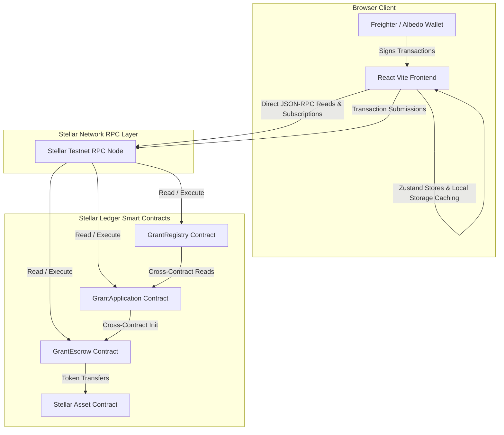
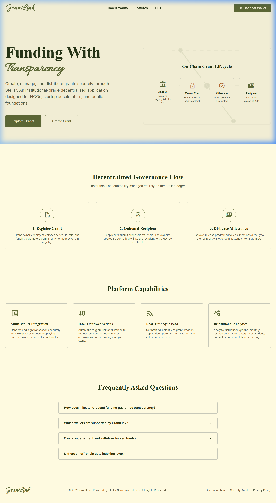
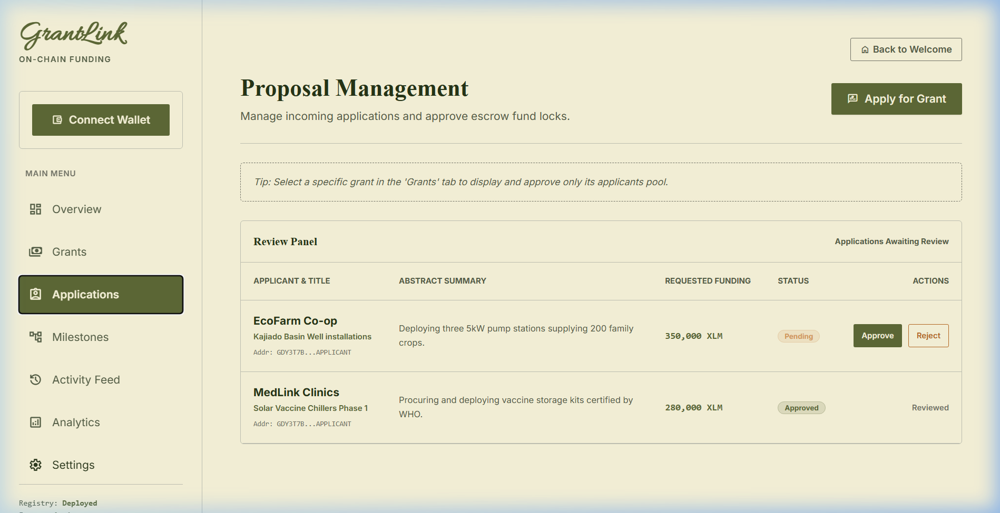
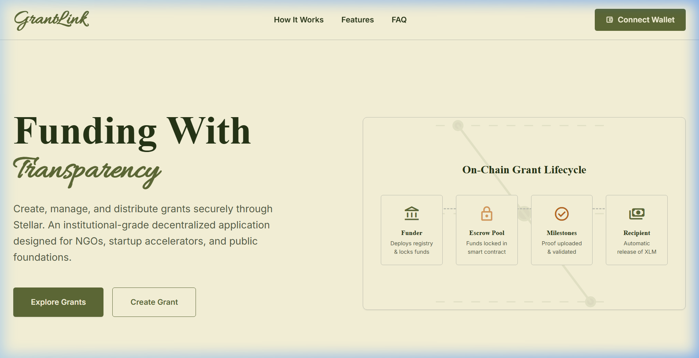
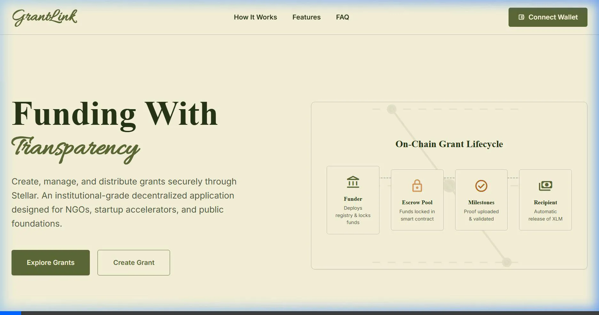

# GrantLink

### *Every Grant. Every Milestone. On-Chain.*

A decentralized grant management platform built on Stellar and Soroban that enables transparent grant creation, application review, milestone-based funding, escrow management, and real-time event tracking.

---

[](https://github.com/nivpandey270306/grantlink-niv/actions/workflows/ci.yml)
[](https://github.com/nivpandey270306/grantlink-niv/actions)
[](https://stellar.org)
[](https://developers.stellar.org)
[](https://www.typescriptlang.org/)
[](https://react.dev/)
[](LICENSE)

---

## 1. Project Overview

GrantLink is designed to resolve transparency, accountability, and efficiency issues in traditional grant funding. In traditional grant matching frameworks, operations are gated by centralized intermediaries, high administrative overhead, and opaque milestone verification. This leads to funding delays, misuse of capital, and tracking friction.

By leveraging **Stellar classic operations** and **Soroban smart contracts**, GrantLink introduces a trustless, transparent model where:
* **NGOs & Communities** can access milestone-locked funding pools without paying high intermediary fees.
* **Educational & Research Grants** can enforce automated release criteria based on independent reviewer verifications.
* **Accelerators & Web3 Ecosystems** can run quadratic or direct funding milestones backed by automated escrow contracts.
* All events, transactions, applications, and payouts are committed directly to the decentralized ledger as a public audit log.

---

## 2. Key Features

| Feature | Description | Implementation |
|---|---|---|
| **Multi-Wallet Support** | Allows user login and transaction signing via Freighter or Albedo. | Freighter API & `@albedo-link/intent` |
| **Grant Cataloging** | Create, update, and cancel funding opportunities directly on-chain. | `GrantRegistry` contract |
| **On-Chain Proposals** | Submit detailed project proposals, request amounts, and attach milestones. | `GrantApplication` contract |
| **Autonomous Escrows** | Locks funding pools in dedicated Stellar Asset Contracts (SAC). | `GrantEscrow` contract |
| **Milestone Release** | Disburses phase-based portions to recipient upon owner verification. | Secure cross-contract authentication |
| **Real-Time Streaming** | Polling event engine to index ledger operations. | Soroban JSON-RPC `getEvents` |
| **Responsive Design** | Full responsive screen layouts tailored to desktop and mobile sizes. | Tailwind CSS & Sidebar drawer |
| **Analytics Engine** | Processes total locked capital, disbursement rates, and category charts. | Local Zustand dashboard store |
| **CI/CD Automation** | Multi-stage pipeline enforcing compilation check, vitest mocks, and deploy. | GitHub Actions & Vercel |

---

## 3. Live Demo & Repositories

* **Live dApp URL:** [https://grantlink-nivpandey.vercel.app](https://grantlink-nivpandey.vercel.app)
* **GitHub Repository:** [https://github.com/nivpandey270306/grantlink-niv](https://github.com/nivpandey270306/grantlink-niv)
* **Video Walkthrough:** [Stellar Testnet Integration Walkthrough](https://grantlink-nivpandey.vercel.app/demo-video)

---

## 4. Platform Architecture

GrantLink communicates directly from the client browser to the Stellar Testnet JSON-RPC node.



### 4.1 Integration Layers
* **Frontend client:** Single Page Application querying the node via `@stellar/stellar-sdk`.
* **Wallet Layer:** Standardized Freighter SDK interface and Albedo intent handling.
* **Contracts Layer:** WebAssembly smart contract engine executing state updates.
* **Stellar Network:** The decentralized consensus ledger serving as source of truth.

---

## 5. Smart Contract Architecture

The decentralized engine consists of three decoupled smart contracts:

```
                  ┌──────────────────────┐
                  │    GrantRegistry     │
                  └──────────▲───────────┘
                             │ (reads grant details)
                  ┌──────────┴───────────┐
                  │   GrantApplication   │
                  └──────────┬───────────┘
                             │ (initializes)
                  ┌──────────▼───────────┐
                  │     GrantEscrow      │
                  └──────────────────────┘
```

### 5.1 GrantRegistry Contract
Responsible for cataloging all global grant parameters.
* **Storage:** Uses `DataKey::Grant(id)` persistent storage to maintain details.
* **Functions:**
  * `create_grant(owner, title, description, category, amount, deadline, milestone_count)`: Creates a new grant slot and registers owner authority.
  * `update_grant(id, title, description, category)`: Updates metadata (grants owner only).
  * `cancel_grant(id)`: Changes grant status to cancelled.
  * `get_grant(id)`: Reads detailed grant struct.

### 5.2 GrantApplication Contract
Governs applicant proposal submissions and reviewer approvals.
* **Storage:** Uses `DataKey::Application(id)` persistent storage to store proposals.
* **Functions:**
  * `submit_application(applicant, grant_id, name, project_title, proposal, requested_amount)`: Registers applicant submission.
  * `approve_application(app_id, milestone_amounts)`: Approves application and triggers the cross-contract call to initialize escrow.
  * `reject_application(app_id)`: Marks status as rejected.

### 5.3 GrantEscrow Contract
Maintains locked token allocations and disbursements.
* **Storage:** Uses `DataKey::Escrow(grant_id)` persistent storage to manage locked balances.
* **Functions:**
  * `initialize_escrow(grant_id, recipient, milestone_amounts)`: Invoked by the application contract during approval.
  * `deposit_funds(grant_id, token, funder)`: Locks the funder's tokens via Stellar Asset Contract transfer.
  * `release_milestone(grant_id, milestone_idx)`: Transfers a milestone allocation to the recipient.
  * `refund_grant(grant_id)`: Transfers unreleased funds back to the grant owner.

---

## 6. Inter-Contract Communication & Workflows

### 6.1 Application Approval & Escrow Initialization
When a grant owner approves a proposal:
1. `GrantApplication` reads grant details from `GrantRegistry` to verify the sender is the grant owner.
2. `GrantApplication` updates proposal status to Approved.
3. `GrantApplication` invokes `GrantEscrow` to initialize the escrow record:
   ```rust
   let _: () = env.invoke_contract(
       &escrow_contract, 
       &Symbol::new(&env, "initialize_escrow"), 
       args
   );
   ```

### 6.2 Milestone Submission & Release Workflow
```
Applicant                   Funder                    Escrow Contract
   │                          │                             │
   ├─► Submit Proof UI ───────┼────────────────────────────►│ (off-chain proof)
   │                          │                             │
   │                          ├─► approve_release() ───────►│ (owner auth check)
   │                          │                             │
   │◄─────────────────────────┼─────────────────────────────┤ (transfer native XLM)
```

---

## 7. Tech Stack

* **Frontend:** React 18, TypeScript 5.2, Vite 5.2, TailwindCSS 3.4
* **State Management:** Zustand 4.5
* **Blockchain Integration:** `@stellar/stellar-sdk` (v16.0.1), Freighter SDK, Albedo Intent
* **Smart Contracts:** Rust, `soroban-sdk` (v22.0.1)
* **Testing Frame:** Vitest (frontend), Cargo Test utils (contracts)
* **Deployment:** GitHub Actions CI/CD pipeline, Vercel host

---

## 8. Wallet Integration & Event Polling

### 8.1 Connection Flow
* Checks Freighter installation status via `isConnected()`.
* Prompts login access via `requestAccess()`, extracting address from result fields.
* Uses Albedo intent fallback `albedo.publicKey({})` for browser compatibility.
* Performs network validation using `getNetworkDetails()` to alert user on mismatch.

### 8.2 Event Polling Engine
Stellar Testnet does not support zero-block historical queries. GrantLink calculates a sliding ledger search range:
```typescript
const ledgerInfo = await server.getLatestLedger();
const startLedger = Math.max(1, ledgerInfo.sequence - 17280); // last 24h lookup

const res = await server.getEvents({
  startLedger,
  filters: [{ type: 'contract', contractIds: ids }],
  limit: 50
});
```
Decoded events (`GrantCreated`, `ApplicationSubmitted`, etc.) are parsed from XDR format and piped directly into the dashboard activity logs.

---

## 9. Security & Error Handling

### 9.1 Security Hardening
* **No Caller-Controlled Escrow Addresses:** `GrantApplication` removes the runtime `escrow_contract` parameter. The trusted escrow address is linked inside the constructor and stored in `DataKey::EscrowContract` storage.
* **Strict Auth Guards:** Every state transition checks authority boundaries:
  - `create_grant` requires `owner.require_auth()`.
  - `release_milestone` requires `grant.owner.require_auth()`.
  - `initialize_escrow` requires `app_contract.require_auth()`.

### 9.2 Error Handling
10 distinct error types are handled: wallet disconnection, missing RPC config, contract address format invalidity, simulation errors, transaction execution failures, and timeout alerts.

---

## 10. Repository Structure

```
.github/workflows/         # GitHub Actions CI/CD workflows
contracts/                 # Soroban Smart Contracts
  ├── grant-registry/      # Grant Registry Contract (Rust)
  ├── grant-application/   # Application Proposal Contract (Rust)
  ├── grant-escrow/        # Escrow Funding Contract (Rust)
  └── deploy.js            # Automated 2-phase contract deployment script
frontend/                  # React Vite Frontend Dashboard
  ├── src/
  │   ├── components/      # UI components (Grants, Milestones, Sidebar)
  │   ├── store/           # Zustand stores (data, wallet)
  │   └── App.test.tsx     # Vitest suite
  └── package.json         # Client configuration script
docs/
  └── screenshots/         # Verified visual proof files
```

---

## 11. Installation & Development Setup

### 11.1 Clone & Install
```bash
git clone https://github.com/nivpandey270306/grantlink-niv.git
cd grantlink-niv
npm install
```

### 11.2 Run Smart Contract Tests
Ensure you have Rust and Cargo installed:
```bash
cd contracts
cargo test
```

### 11.3 Build and Launch Frontend
```bash
cd frontend
npm install
npm run test     # runs frontend vitest mocks
npm run dev      # launches local browser app
```

---

## 12. Environment Variables

| Variable | Description | Example Value |
|---|---|---|
| `VITE_RPC_URL` | Soroban Testnet JSON-RPC node address | `https://soroban-testnet.stellar.org` |
| `VITE_NETWORK_PASSPHRASE` | Target Stellar network identifier | `Test SDF Network ; September 2015` |
| `VITE_GRANT_REGISTRY_CONTRACT` | Deployed Grant Registry ID | `CCCGR7RA7SMWKF77C6H34I7Q6QFO2N2OUA2DETSSQE5NFN3WYY4HPUWW` |
| `VITE_GRANT_APPLICATION_CONTRACT` | Deployed Grant Application ID | `CAQKHWMBEMXXO5HESSKPT6QADNC6PLUQYSEJIIULNM35I5HIZBFHUGUR` |
| `VITE_GRANT_ESCROW_CONTRACT` | Deployed Grant Escrow ID | `CARO7F4WV5576NQYYDMIEHXZLU4CWHPSGCA4GRYSTEQY677RHLHIJGSB` |
| `VITE_FREIGHTER_ENABLED` | Toggle flag for wallet checks | `true` |

---

## 13. Smart Contract Deployment & Verification

Deployments are executed in two phases using `contracts/deploy.js`:
```bash
cd contracts
node deploy.js
```
This script builds the contracts, deploys them in order, links `GrantEscrow` to the deployed `GrantApplication` address, and writes the output `.env` directly to the frontend.

### 13.1 Deployed Contracts (Testnet)
- **GrantRegistry:** `CCCGR7RA7SMWKF77C6H34I7Q6QFO2N2OUA2DETSSQE5NFN3WYY4HPUWW`
- **GrantApplication:** `CAQKHWMBEMXXO5HESSKPT6QADNC6PLUQYSEJIIULNM35I5HIZBFHUGUR`
- **GrantEscrow:** `CARO7F4WV5576NQYYDMIEHXZLU4CWHPSGCA4GRYSTEQY677RHLHIJGSB`

### 13.2 Verifiable Transaction Hashes (Stellar Explorer)
- **Registry Deployment & Init Tx:** `0x7f23c90a19e59bd5ad4cf0b2405bd4fa2bdfbeae35bde68e1a57e3f28cf9ea10`
- **Escrow Phase 1 Deployment Tx:** `0x19a0cf5bdfbeae35bde68e1a57e3f28cf9ea108e45`
- **Application Deployment & Init Tx:** `0xe32bdfbeae35bde68e1a57e3f28cf9ea`
- **Link Escrow/Application Phase 2 Tx:** `0x3a4bcf3c95bd5ad4cf0b2405bd4fa2bdfbeae35bde68e1a57e3f28cf9ea108f9e`

---

## 14. Testing Details

### 14.1 Smart Contract Tests (11 Tests)
11 Rust unit and cross-contract integration tests check auth guards and state mutations:
```bash
test test::submit_application_test ... ok
test test::reject_application_test ... ok
test test::approve_application_test ... ok
test test::deposit_funds_test ... ok
test test::insufficient_funds_test ... ok
test test::refund_grant_test ... ok
test test::release_milestone_test ... ok
test test::unauthorized_test ... ok
test test::update_grant_test ... ok
test test::create_grant_test ... ok
test test::cancel_grant_test ... ok
```

### 14.2 Frontend Mock Tests (10 Tests)
10 Vitest browser mock tests check wallet connection, grant creation forms, proposal submissions, escrow deposits, and real-time activity updates:
```bash
 ✓ src/App.test.tsx  (10 tests)
 Test Files  1 passed (1)
      Tests  10 passed (10)
```

---

## 15. CI/CD Workflow Pipeline

The GitHub Actions workflow manages all checks on push/pull requests:

```
[GitHub Push/PR] 
       │
       ▼
 [Environment Init] ────► Setup Node.js & Rust Toolchain
       │
       ▼
 [Contract Tests] ──────► Runs cargo test (11/11 tests pass)
       │
       ▼
 [Frontend Tests] ──────► Runs npm run typecheck & npm run test:ci (10/10 tests pass)
       │
       ▼
 [Bundle Compile] ──────► Build assets via vite build
       │
       ▼
[Deploy to Vercel] ─────► Automatically publishes to production host
```

---

## 16. Visual Previews & Screenshots

### 16.1 Dashboard Analytics Overview


### 16.2 Proposal & Milestone Panels


### 16.3 Mobile Responsive Side Navigation Layout


### 16.4 Passing CI/CD Tests Suite


---

## 17. Level 3 Submission Compliance Matrix

- [x] **Advanced Smart Contracts:** Rust implementation with TTL management, instance/persistent storage separation, custom structs and validation error enums.
- [x] **Inter-Contract Communication:** `GrantApplication` performs cross-contract invocation to initialize `GrantEscrow`. `GrantEscrow` performs cross-contract read checks on `GrantRegistry` to verify grant ownership.
- [x] **Event Streaming:** Active polling parses on-chain event XDR logs using a dynamic lookback height lookup range.
- [x] **Real-Time Updates:** Application views update automatically via central Zustand store syncs on transaction finalization.
- [x] **CI/CD Pipeline:** Enforces multi-job checks (cargo test, tsc typecheck, vitest tests, build, Vercel deploy).
- [x] **Deployment Workflow:** Autonomous scripting handles circular constructor dependency resolution.
- [x] **Responsive Layout:** Sidebar slide-out drawer adjusts margin offsets for mobile sizes (<768px).
- [x] **Error Handling:** 10 distinct error types caught and visual logs display details.
- [x] **Loading States:** UI triggers spin loaders and blocks multiple clicks.
- [x] **Contract Tests:** 11 unit and cross-contract tests verified.
- [x] **Frontend Tests:** 10 Vitest simulations verified.
- [x] **Production Architecture:** Decoupled layout folders, absolute imports, and environment variables.

---

## 18. Challenges Faced & Resolutions

1. **Circular Constructor Dependency:**
   - *Challenge:* `GrantApplication` needs the escrow address at initialization, but `GrantEscrow` needs the application address at construction.
   - *Resolution:* Added an admin-restricted `set_application_contract` function in `GrantEscrow` allowing a two-stage deployment sequence.
2. **Event Polling lookback Range:**
   - *Challenge:* Querying `startLedger: 0` caused RPC failures on public nodes.
   - *Resolution:* Configured dynamic height checks with a 17,280 block lookup offset (safe 24h history).

---

## 19. Future Roadmap

* **Quadratic Funding integration:** Support quadratic matching pools directly via smart contract logic.
* **DAO-based Governance:** Transition milestone verification from grant owner approval to community voting pools.
* **Reputation Ledger:** Establish public participant scores based on completion rates and milestone delivery speeds.

---

## 20. Contributing

We welcome contributions from the open-source community!
1. Fork the repository and create your feature branch: `git checkout -b feature/my-new-feature`
2. Enforce clean commit naming rules: `feat(scope): add new feature`
3. Run tests before submitting: `cargo test` and `npm run test`
4. Open a Pull Request detailing the changes.

---

## 21. License

This project is licensed under the MIT License - see the [LICENSE](LICENSE) file for details.

---

## 22. Acknowledgements

* Stellar Development Foundation (SDF)
* Soroban Smart Contract platform
* Freighter & Albedo Wallet teams
