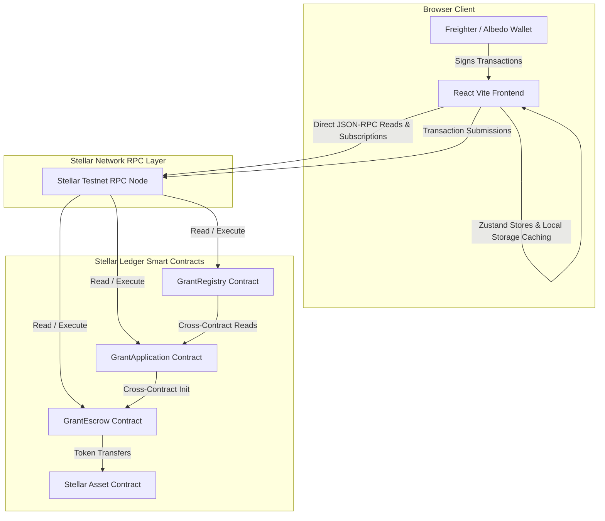

# GrantLink

[](https://github.com/user/grantlink/actions/workflows/ci.yml)

> Every Grant. Every Milestone. On-Chain.

GrantLink is an institutional-grade, fully decentralized grant management platform built on the Stellar network using Soroban smart contracts. It operates entirely without centralized servers, databases, or middle tiers, communicating directly from the browser client to the Stellar ledger via secure wallets and Soroban RPC nodes.

---

## 100% Decentralized Architecture Diagram



---

## Key Features

1. **Pure dApp Design:** Zero databases, Express APIs, or backend nodes. All critical state is maintained directly on the Stellar blockchain.
2. **Multi-Wallet Integration:** Secure sign-in and transaction signing via Freighter Wallet (browser extension) or Albedo Wallet (web/intent).
3. **On-Chain Milestone Locking:** Escrows automatically initialize upon proposal approval. Funder locks total grant allocations in the contract.
4. **Soroban RPC Event Streaming:** Polls and reads ledger event timelines (`GrantCreated`, `ApplicationSubmitted`, etc.) natively from the Soroban node.
5. **Analytics Dashboard:** Graphical analysis of funding distributions, milestone completion status, and category allocations generated in real-time from ledger states.

---

## Smart Contract Structure

GrantLink utilizes three interacting Soroban contracts:

### 1. GrantRegistry
Maintains global grant definitions, creator addresses, and allocations.
- `create_grant(owner, title, description, category, amount, deadline, milestones)`
- `update_grant(id, title, description, category)`
- `cancel_grant(id)`
- `get_grant(id)`
- `list_grants()`: Returns all grants on-chain

### 2. GrantApplication
Handles proposal submissions and reviewer approvals.
- `submit_application(applicant, grant_id, name, project_title, proposal, requested_amount)`
- `approve_application(app_id, escrow_contract, milestone_amounts)`: Cross-contract calls `GrantEscrow::initialize_escrow`
- `reject_application(app_id)`
- `get_application(app_id)`
- `list_applications()`: Returns all applications on-chain

### 3. GrantEscrow
Governs assets locking, verification proof releases, and refunds.
- `initialize_escrow(grant_id, recipient, milestone_amounts)`: Guarded by application contract call checks
- `deposit_funds(grant_id, token, funder)`: Locks assets via token transfer
- `release_milestone(grant_id, milestone_idx)`: Releases phase amount to recipient. Verification requires owner approval
- `refund_grant(grant_id)`: Cancels escrow and refunds unreleased balances to owner

---

## Environment Variables

Configure these variables inside your `frontend/.env` file:

- `VITE_RPC_URL="https://soroban-testnet.stellar.org"`
- `VITE_NETWORK_PASSPHRASE="Test SDF Network ; September 2015"`
- `VITE_GRANT_REGISTRY_CONTRACT="CC..."`
- `VITE_GRANT_APPLICATION_CONTRACT="CC..."`
- `VITE_GRANT_ESCROW_CONTRACT="CC..."`
- `VITE_FREIGHTER_ENABLED="true"`

---

## Installation & Setup

### Prerequisites
- Node.js (v20+)
- Cargo & Rust (targets `wasm32-unknown-unknown`)
- Stellar CLI

### Smart Contracts Compilation
1. Build WASM files:
   ```bash
   cd contracts
   cargo build --target wasm32-unknown-unknown --release
   ```
2. Run local tests:
   ```bash
   cargo test
   ```

### Frontend Dashboard Setup
1. Install dependencies:
   ```bash
   cd frontend
   npm install
   ```
2. Run the development server:
   ```bash
   npm run dev
   ```
3. Run Vitest checks:
   ```bash
   npm run test
   ```

---

## CI/CD Pipeline Workflow

The repository coordinates GitHub Actions workflows:
`Push/Pull Request` -> `Set up Node & Rust` -> `Install Dependencies` -> `Rust Contract Tests` -> `Vitest Frontend Tests` -> `Build and Bundle` -> `Vercel / Netlify Deployment`.
